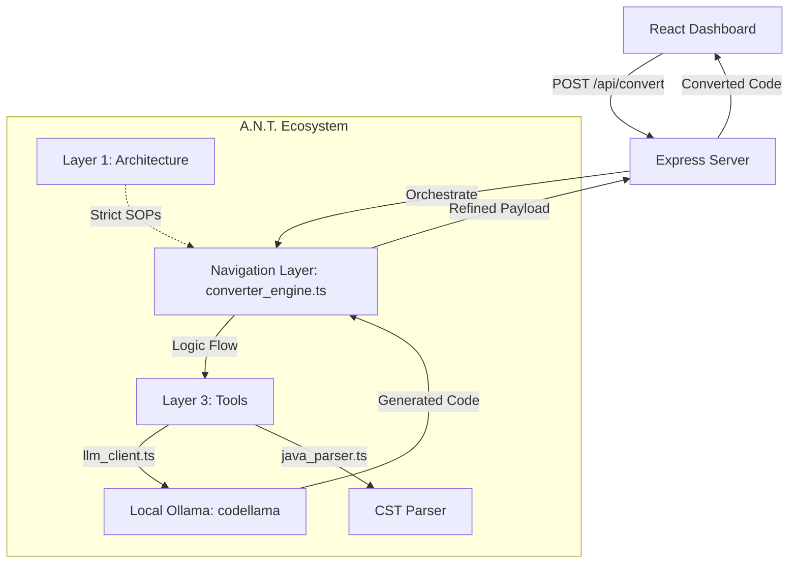

# 🚀 Conversion Sentinel: Selenium to Playwright (Ollama)

**Conversion Sentinel** is a premium, deterministic migration tool designed to convert Selenium Java (TestNG) automated tests into Playwright TypeScript with 1:1 functional precision. Powered by local LLMs via Ollama (`codellama`).

 *(Note: Placeholder link if image exists)*

## 🛠️ Architecture: The A.N.T. Framework

This project follows the **A.N.T.** (Architecture, Navigation, Tools) 3-layer methodology to ensure reliability and separation of concerns.



### 1. Architecture (`/architecture`)
Contains the **Conversion SOP**. This is the "Golden Rule" document that dictates exactly how Java elements (Annotations, Locators, Assertions) must be mapped to Playwright.

### 2. Navigation (`/navigation`)
The "Brain" of the system. It receives raw source code, prepares the context based on the SOP, and routes data through the tools to produce the final payload.

### 3. Tools (`/tools`)
Deterministic scripts for execution:
- **`llm_client.ts`**: Communicates with the local Ollama API.
- **`java_parser.ts`**: Extracts structure from Java files.
- **`handshake.ts`**: Verifies connectivity to the LLM.

---

## ✨ Features
- **Deterministic Mapping**: No guessing. Follows a strict 1:1 mapping SOP.
- **Glassmorphism UI**: Beautiful, interactive dashboard for real-time comparison.
- **Local LLM Performance**: Uses `codellama` for high-fidelity code transcription without data leaving your machine.
- **Copy-to-Clipboard**: One-click migration of generated code.

---

## 🚀 Getting Started

### Prerequisites
- [Node.js](https://nodejs.org/) (v18+)
- [Ollama](https://ollama.com/) installed and running.
- Pull the model: `ollama pull codellama`

### Installation
1. Clone the repository:
   ```bash
   git clone https://github.com/sandeepgupta220427/Project2-Selenium2PlaywrightLocalLLM.git
   cd Project2-Selenium2PlaywrightLocalLLM
   ```
2. Install dependencies:
   ```bash
   npm install
   ```
3. Configure Environment:
   Create a `.env` file (already provided in local, check `.env.example` if applicable):
   ```env
   LLM_ENDPOINT=http://localhost:11434/api/generate
   LLM_MODEL=codellama
   ```

### Running the App
Start both the Frontend (Vite) and Backend (Express) concurrently:
```bash
npm start
```
- **UI**: `http://localhost:5173`
- **API**: `http://localhost:3001`

---

## 📋 Conversion Examples

| Feature | Selenium Java (TestNG) | Playwright TypeScript |
| :--- | :--- | :--- |
| **Annotation** | `@Test` | `test('name', async ({ page }) => { ... })` |
| **Locator** | `driver.findElement(By.id("login"))` | `page.locator('#login')` |
| **Action** | `.sendKeys("user")` | `.fill("user")` |
| **Assertion** | `Assert.assertEquals(a, b)` | `expect(a).toBe(b)` |

---

## 📜 Project Protocol
Built using the **B.L.A.S.T.** (Blueprint, Link, Architect, Stylize, Trigger) protocol. See [BLAST.md](./BLAST.md) for details.
